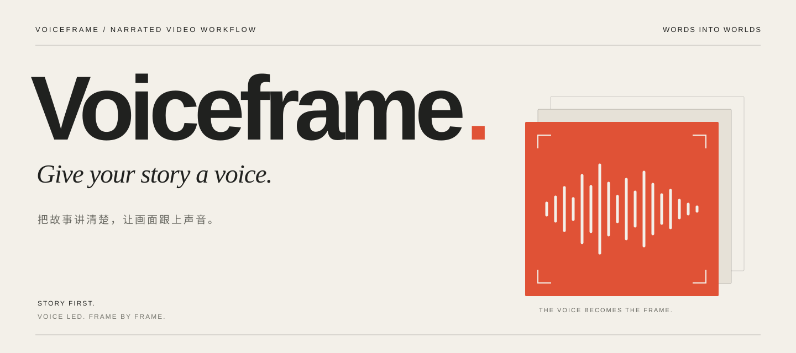

<p align="center">
  
</p>

<p align="center">
  <strong>从文字到声音，从声音到画面。</strong><br>
  <sub>为 AI Agent 设计的旁白视频制作工作流。</sub>
</p>

<p align="center">
  <a href="#开始创作">开始创作</a> &nbsp; / &nbsp;
  <a href="docs/usage.md">使用指南</a> &nbsp; / &nbsp;
  <a href="skills/voiceframe/SKILL.md">Skill 入口</a>
</p>

<br>

## 好的画面，从一个讲得清楚的故事开始。

Voiceframe 将文案与自录口播，组织成剧本、分镜、音轨与制作交接记录。让 Agent 围绕同一个故事推进工作，从最初的构想到最后的成片。

用它制作知识讲解、技术科普、产品介绍，也可以只完成一次审稿、一组分镜或一条旁白。

<br>

<p align="center">
  
</p>

<br>

### 先把故事讲清楚

简报明确目标，剧本梳理叙事，分镜确定构图。画面制作之前，先得到可以审阅、可以讨论的创作方案。

### 让画面跟上声音

使用 AI 旁白或自己的录音，测量音轨时长，生成时间轴与字幕时间块。短片按段迭代，长片保留整段叙述的连贯性。

### 在你选择的工具里完成作品

用通用文档与素材交接不同阶段，记录制作与导出约定。选择 HyperFrames 时，可按需附带 HTML 工程骨架。

<br>

## 开始创作

将 [`skills/voiceframe/`](skills/voiceframe/) 完整安装到 Agent 的 Skill 目录。例如，在 Codex 默认目录安装时，从本仓库根目录执行，确保目标目录尚不存在：

```bash
cp -R skills/voiceframe ~/.codex/skills/voiceframe
```

然后，把你的创作意图交给 Agent：

```text
$voiceframe
把这篇文章做成一支 3 分钟的中文讲解视频。
先给我剧本和分镜草稿，画面简洁，使用 AI 旁白。
```

也可以先创建项目，在文档中整理想法：

```bash
python3 skills/voiceframe/scripts/init_project.py ../my-video
```

项目包含 `BRIEF.md`、`frame.md`、`STORYBOARD.md`、`SCRIPT.md` 和 `PRODUCTION.md`，分别记录需求、视觉、分镜、口播与制作交接。

**下一步 →** [配音、录音索引与字幕生成](docs/usage.md)

<br>

## 为创作留出选择

**声音** &nbsp; 内置百炼配音与自备音频索引。其他配音服务可按项目需要选择，调用方式由对应工具完成。

**画面** &nbsp; 默认采用应用中立的项目文档。HyperFrames 提供可选模板；其他应用通过文档、素材和音频索引交接。

**交付** &nbsp; 保留原始媒体、事实来源和制作记录，在选定应用中检查音画、字幕与导出结果。

<details>
<summary><strong>实现范围与环境要求</strong></summary>

初始化与字幕切分使用 Python 3 标准库；测量音频需要 FFprobe。AI 配音需要已配置的百炼 `bl` CLI，AI 整段模式的辅助对齐还需要 FFmpeg 与 NumPy。

音轨总时长为实测值，整段模式的句子边界与字幕时间块通过比例估算，需要试听校对。整段 AI 配音还会生成辅助分段音频，产生额外调用。

自录音频的后期处理方案尚未实测。其他剪辑应用目前没有内置自动导入转换器；HTML 模板与音频索引均为制作中间产物，仍需完成合成、检查与导出。

</details>

<br>

## 深入了解

| 创作 | 制作 |
| :--- | :--- |
| [剧本与分镜](skills/voiceframe/references/storyboard.md) — 把叙事转成画面 | [配音与音轨](skills/voiceframe/references/tts-voice.md) — 短片、长稿与音色 |
| [模板与工具](skills/voiceframe/references/templates.md) — 项目骨架与参数 | [制作与交付](skills/voiceframe/references/production.md) — 应用交接与成片检查 |
| [Skill 工作流](skills/voiceframe/SKILL.md) — Agent 的制作约定 | [HyperFrames](skills/voiceframe/references/adapters/hyperframes.md) — 可选适配指南 |

<br>

---

<p align="center">
  <sub>VOICEFRAME</sub><br>
  <sub>A story worth telling. A voice worth following.</sub>
</p>
